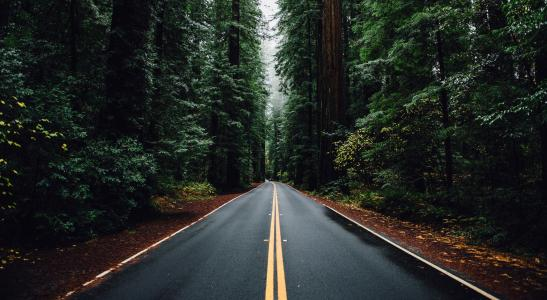
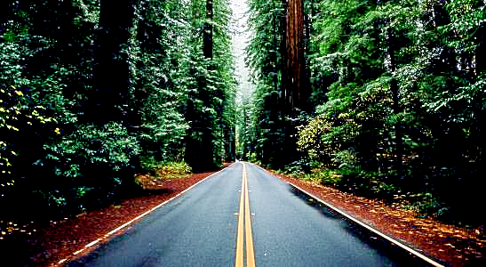

## 低光照下的图像增强_C++
摘要

当光线不足的条件下拍摄图像时，图像通常会出现低能见度。除了降低图像的视觉美感外，这种低质量还可能显着降低许多计算机视觉和多媒体算法的性能，本算法主要是为高质量输入而设计。在本文中，提出了一种简单而有效的低光图像增强（LIME）方法。首先通过找到R，G和B通道中的最大值来单独估计每个像素的照度。此外，通过在其上施加结构作为最终照明图来细化初始照明图。具有良好构造的照明图，可以相应地实现增强。

We provide a c++ version of low-light enhancement technology, which is helpful for vSLAM and line dect,etc.

Everyone can use it, and stars are necessary.

### Related Publications

* **[LIME](https://ieeexplore.ieee.org/document/7782813/)**, X. Guo, Y. Li and H. Ling, "LIME: Low-Light Image Enhancement via Illumination Map Estimation," in IEEE Transactions on Image Processing, vol. 26, no. 2, pp. 982-993, Feb. 2017.

# Preparation
Clone the code
```
git clone https://github.com/Quitino/LIME_Process.git
```
Then build the project 
```
cd LIME_Processing
mkdir build 
cd build 
cmake ..
make
```
run the project 
```
cd ../bin
./LIME
```
## Result
处理前:



处理后：


